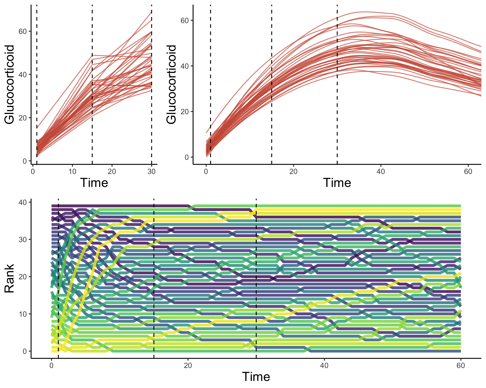

# Description

**simcoRt: a package for simulating acute glucocorticoid responses**

This set of cunctions simulates response curves that have characteristics similar to the acute glucocorticoid stress response. Briefly, the simulation can create simulated datasets with user specified characteristics. True phenotype values for individual animals are simulated and then used to generate an arbitrary number of expressed response curves with various amounts of within-individual variation and with specified variance and covariance structure. These functions can be used to simulate the consequences of different patterns of variation (e.g., different degrees of covariation in the speed vs. scope of the response). The package can also be used to test experimental designs for their power to detect different patterns of variation in physiological flexibility.

# Author

This package is written and maintained by Conor Taff (cct663@gmail.com).

# Installation

You can install this package using:

``` r
devtools::install_github("cct663/simcoRt")
```

# Example

An example dataset simulated with the default parameters looks something like this.



# License
